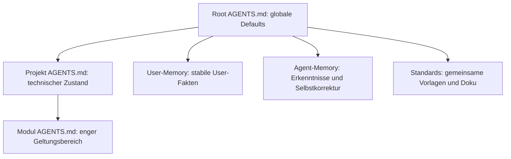

<!--
Agent: OpenCode
Model: github-copilot/gpt-5.6-sol
Auftraggeber: [private user]
Datum + Uhrzeit: 2026-07-29T23:20:33+02:00
Zweck / Warum: Kompakte Menschenansicht der kanonischen Agenten-Gedächtnis-Architektur.
-->

# Gedächtnis-Architektur

Die kanonische technische Beschreibung steht in
`C:\GIT\agent-memory\meta\memory-architecture.md`. Diese Seite ist ihre kompakte
Menschenansicht.

## Prinzipien

- **Vererbung:** Die nächste anwendbare Ebene erbt, ergänzt, überschreibt oder negiert Aussagen
  nach dem [gemeinsamen Workspace-Modell](../shared/inheritance.md).
- **Selektiver Abruf:** Ein knapper Index verweist per `READ-WHEN` auf tiefe Details.
- **SSOT und DRY:** Operative Regeln und ihr Kontext stehen einmal kanonisch; Erklärseiten
  verlinken dorthin.
- **Zugriffstemperatur:** Hot/warm/cold/archive beschreibt Zugriff, nicht Wahrheit.
- **Verdichtung:** Details bleiben rekonstruierbar, während aktive Sichten knapp bleiben.

Mehr zur praktischen Einordnung: [Betriebsmodell](operating-model.md).
