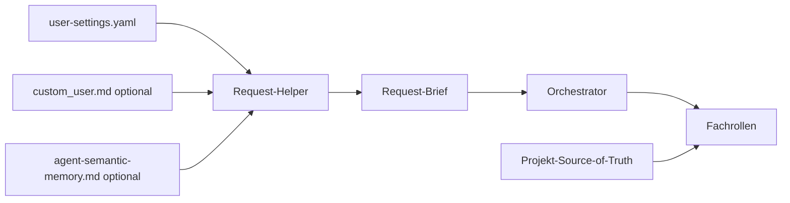

# Kontext- und Gedächtnisarchitektur

Das Ziel ist nützlicher Langzeitkontext ohne globale Chronik.

## Ebenen

| Ebene | Zweck | Laden |
|---|---|---|
| User Settings | Sprache, Stil, erlaubte Kontextquellen | primärer Agent |
| Custom User | freiwilliger, userverwalteter Kontext | nur berechtigte Rollen |
| Semantic Memory | kurze bestätigte Fakten und Candidates | rollen- und budgetabhängig |
| Request-Brief | aufgabenrelevante Verdichtung | Orchestrator und Fachrollen |
| Projektwissen | Requirements, Code, Tests, Entscheidungen | zuständiges Fach-Repo |
| Archiv | Rohchats und Historie | niemals automatisch |

Aktuelle User-Aussage und Fach-Source-of-Truth haben Vorrang. Git bewahrt frühere Werte;
Memory wird aktualisiert und verdichtet statt chronologisch erweitert.

Das vollständige vorgeschlagene Format steht im
[portablen Workspace-Konzept](portable-engineering-workspace.md#semantisches-memory).
