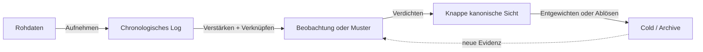

<!--
Agent: OpenCode
Model: github-copilot/gpt-5.6-sol
Auftraggeber: [private user]
Datum + Uhrzeit: 2026-07-29T23:20:33+02:00
Zweck / Warum: Menschenlesbare Übersicht des Gedächtnis-Betriebsmodells ohne operative Regeln zu duplizieren.
-->

# Betriebsmodell

Diese Seite erklärt das System. Sie ist **keine zusätzliche Regelquelle**. Bei Abweichungen
gelten die unten verlinkten kanonischen Dateien.

## Kanonische Quellen

| Thema | Einzige kanonische Quelle (Single Source of Truth) |
|---|---|
| Globale Pflichten, Vererbung, Zugriff, Routing | `C:\GIT\AGENTS.md` |
| Gemeinsame Dokumentation und Vorlagen | `C:\GIT\standards\AGENTS.md` |
| Projektzustand und lokale Regeln | nächste anwendbare `{repo}\AGENTS.md` |
| Projektvision und Fachanforderungen | durch die Repo-`AGENTS.md` verlinkter Project Brief beziehungsweise Requirements-Datei |
| User-Kontext | `C:\GIT\user-memory\AGENTS.md` und `profile.md` |
| Agent-Memory-Struktur | `C:\GIT\agent-memory\meta\memory-architecture.md` |
| Gewichtung und Verdichtung | `C:\GIT\agent-memory\meta\memory-consolidation.md` |
| Agent-Grundsätze und Konflikte | `agent-principles.md` und `manifest\CONSTITUTION.md` |
| Workspace-Entscheidungen | `C:\GIT\.memory\decisions.md` |

## Vier Achsen

Das System trennt vier Eigenschaften, die nicht miteinander verwechselt werden dürfen:

1. **Zuständigkeit (Ownership):** Projekt-, User-, Agent- oder Workspace-Memory.
2. **Geltungsbereich (Scope):** Root-Default bis zum spezifischen Verzeichnis-Unterbaum.
3. **Abruf-Temperatur (Retrieval):** hot, warm, cold oder archive.
4. **Salienz:** kombinierte Indizien innerhalb des geladenen Kontexts.

Pfadtiefe bedeutet höhere Spezifität und meist geringere allgemeine Zugriffshäufigkeit. Sie ist
kein Relevanz- oder Wahrheitsscore. Bei passendem Geltungsbereich kann eine tiefe Datei die wichtigste
Quelle sein.

## Warum das technisch plausibel ist

- Der offene [AGENTS.md-Standard](https://agents.md/) beschreibt verschachtelte Dateien und
  Vorrang der nächsten anwendbaren Datei.
- [OpenAI Codex](https://developers.openai.com/codex/guides/agents-md/) verkettet Anweisungen
  vom Projekt-Root bis zum Arbeitsverzeichnis.
- [OpenCode](https://opencode.ai/docs/rules/) lädt lokale und globale Regeln anders. Zusätzliche
  Dateien müssen konfiguriert oder über explizite Verweise bedarfsgerecht gelesen werden.
- Anthropic empfiehlt beim
  [Context Engineering](https://www.anthropic.com/engineering/effective-context-engineering-for-ai-agents)
  den kleinsten ausreichenden Kontext, Just-in-time-Abruf und schrittweise Offenlegung. Dort
  werden Pfade, Dateinamen und Zeitstempel ausdrücklich als nützliche Signale genannt.

Die Vererbung ist deshalb ein **explizites Workspace-Protokoll**. Sie nutzt dokumentierte
Funktionen der Tools, setzt aber nicht voraus, dass alle Laufzeiten Dateien identisch laden.

## Gestuftes Gedächtnis (Tiered Memory)

Das bekannte Betriebsmodell heißt **tiered storage** beziehungsweise **Information Lifecycle
Management (ILM)**; die physische Speicherbewegung ist mit **Hierarchical Storage Management
(HSM)** verwandt.

| Temperatur | Typischer Zugriff | Beispiele |
|---|---|---|
| Hot | routinemäßig oder aktiv aufgabenbezogen | aktueller Filesystem-/Code-Stand, uncommittierter Diff, anwendbare Regeln, jüngste relevante Commits |
| Warm | bei plausiblem Aufgabenbezug | weiter zurückliegende relevante Commits, aktuelle Handovers, verdichtete Learnings |
| Cold | gezielte Suche | aufgabenferne Historie, Chat-Rohdaten, seltene Details |
| Archive | selten; bei Audit, Rebuild oder Regression hochstufen | ersetzte oder widerlegte Evidenz, alte Logs, Snapshots |

Diese Baseline ist dynamisch: Git-Historie kann auf jeder Temperatur liegen. Der Agent bestimmt
die Lesetiefe nach Aufgabe, Änderungsrate, Risiko, Widersprüchen und Evidenzbedarf, nicht nach
starren globalen Tagesgrenzen. Der aktuelle Stand hat normalerweise Vorrang; eine Regression
kann aber einen alten Commit sofort hot machen. Kompressions- und Speichertiers sind davon
getrennte Implementierungsdetails.

Die vier Namen sind grobe Anker auf einem Kontinuum, keine harten Behälter. Begriffe wie
`very warm`, `very cold` oder `deep archive` dürfen eine Zwischen- oder Randlage beschreiben,
ohne das gemeinsame Modell um zusätzliche Pflichtstufen zu erweitern.

Die Begriffe sind aus Storage-Systemen entlehnt. Azure dokumentiert
[Hot, Cool, Cold und Archive](https://learn.microsoft.com/en-us/azure/storage/blobs/access-tiers-overview),
AWS unter anderem
[Glacier Deep Archive](https://aws.amazon.com/s3/storage-classes/) und Google
[Standard bis Archive](https://cloud.google.com/storage/docs/storage-classes).
Anbieter verwenden wenige diskrete Klassen plus automatische Lifecycle-Regeln. Unsere Anwendung
auf Kontextabruf ist eine bewusste Analogie, keine Behauptung physischer Speicherautomatik.

## Probabilistische Salienz

Im dateibasierten System gibt es keine eigenen trainierten Aufmerksamkeitsgewichte. Deshalb werden
mehrere schwache Signale kombiniert:

- anwendbare Vererbung und `READ-WHEN`;
- Aufgaben-, Rollen-, Projekt- und Pfadbezug;
- Konsequenz, Evidenz, Vertrauensgrad (Confidence) und Gültigkeit;
- Überschriften, Fettdruck, frühe Platzierung und Warnhinweise;
- Wiederholung aus unabhängigen Beobachtungen;
- Links, Sprungmarken, Zitate und erfolgreiche Nutzung;
- Aktualität bei zustandsabhängigen Informationen.

Markdown-Hervorhebung und Worthäufigkeit sind wertvolle Indizien, aber keine Autorität. Eine
häufig duplizierte falsche Regel wird dadurch nicht kanonisch.

## Lebenszyklus

Markdown und Git bleiben rekonstruierbare Quellen. MkDocs, Volltextindex, Scores und spätere
Vector- oder Graph-Indizes sind ableitbare Sichten und müssen neu erzeugbar sein.

Das entspricht [Docs as Code](https://www.writethedocs.org/guide/docs-as-code/) und wird durch
[PRO-LONG](https://arxiv.org/abs/2607.20064) als verwandten Ansatz gestützt: vollständige,
strukturierte Interaktionslogs plus programmatische Suche können bei langen Agentenaufgaben
effizient sein. Das Paper beweist nicht automatisch die Qualität dieses konkreten Workspace.

## Projekt-Wiederaufnahme

Ein Projekt braucht nur die Zustandsartefakte, die tatsächlich Mehrwert bieten. `AGENTS.md`
enthält den knappen aktuellen Einstieg; umfangreiche Pläne, TODOs, Fortschrittsprotokolle,
Decisions, Handovers oder Wiederherstellungsanleitungen werden bei Bedarf ausgelagert und verlinkt. Eine starre
Dateiliste für jedes Repo würde KISS und SSOT verletzen.

Vision, Fachanforderungen und akzeptierte Changes bleiben dagegen im Fach-Repo und werden vom
Router auffindbar gemacht. Das skalierbare Modell und die Trennung von Vendor-Instructions stehen
im [Repository-Wissensmodell](../shared/repository-knowledge.md).

Architektonisch wichtige Entscheidungen werden als knappe, verlinkte ADRs geführt. Die
[Azure-ADR-Empfehlung](https://learn.microsoft.com/en-us/azure/well-architected/architect-role/architecture-decision-record)
fordert Kontext, Optionen, Abwägungen, Confidence und Status sowie neue ablösende Einträge
statt rückwirklichem Umschreiben.

## Weiter

- [AI-native Engineering](ai-native-engineering.md)
- [Forschungs- und Praxisgrundlagen](../shared/research-foundations.md)
