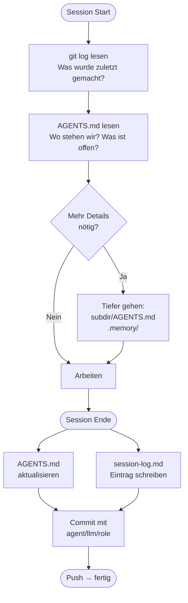

# KI-Agenten als Teamkollegen — Das lebende Gedächtnis-System

> **Für:** Entwickler, Kollegen, alle die mit KI-Agenten zusammenarbeiten
> **Stand:** Juli 2026 · Thomas Denk, Siemens AG
> **Basis:** Eigene Praxis + wissenschaftlicher Stand (Stanford, arxiv 2023–2026)

---

## Das Problem: KI-Agenten vergessen alles

Stell dir vor, du hast einen brillanten neuen Kollegen — er ist schnell, kennt alle
Technologien, macht kaum Fehler. Aber jeden Morgen kommt er mit **totalem Gedächtnisverlust**
zur Arbeit. Er weiß nicht mehr was er gestern gemacht hat, welche Entscheidungen getroffen
wurden, wie du arbeitest oder was das Projekt eigentlich ist.

Das ist der Standardzustand von KI-Agenten heute.

!!! success "Unsere Lösung"
    Wir bauen dem Agenten ein externes Gedächtnis — strukturiert, lebendig, selbst-aktualisierend.
    Wie ein neuronales Netz aus Dateien: nur die relevanten Knoten feuern, wenn sie gebraucht werden.

---

## Die 4 Gedächtnis-Layer

=== "Layer 1: Git History"

    **Das unveränderliche Langzeitgedächtnis**

    Git speichert automatisch **Was** geändert wurde. Wir ergänzen das **Warum**:

    ```
    feat(benchmark): Siemens-API parallel anfragen statt serial

    Siemens hat Serverinfrastruktur für echte Parallelität.
    Lokal: ein Modell = ganzes VRAM → immer serial bleiben.
    ThreadPoolExecutor mit 5 Workers (ein pro Modell).

    agent: GitHub Copilot CLI | llm: Claude Sonnet 4.6 | role: Senior Dev
    ```

    Jeder Commit nennt: **Was** · **Warum** · **Welcher Agent** · **Welches LLM**

    → In 12 Monaten kann ein neuer Agent `git log` lesen und sofort verstehen
    was passiert ist und warum.

=== "Layer 2: Code + Kommentare"

    **Die lebende Wahrheit — Single Source of Truth**

    Code kommentiert man nicht um zu erklären WAS er tut — das sieht man.
    Man kommentiert **WARUM** er genau so tut und nicht anders.

    ```python
    # ❌ WERTLOS — git weiß das schon
    options["num_predict"] = -1  # setzt num_predict auf -1

    # ✅ WERTVOLL — steht nirgendwo sonst
    # Ollama Default wäre 128 Token — zu kurz für SQL-Ausgaben.
    # -1 = kein Limit. 0 würde mit Timeout abbrechen (Ollama-Bug seit v0.3).
    options["num_predict"] = -1
    ```

    !!! tip "Faustregel"
        Wenn dein Kommentar beschreibt **WAS** der Code tut — lösch ihn.
        Git weiß das bereits. Schreib stattdessen **WARUM**.

=== "Layer 3: AGENTS.md Hierarchie"

    **Das aktive Arbeitsgedächtnis — wie ein Datenbank-Index**

    ```
    C:\GIT\AGENTS.md              ← Global: Regeln für alle Repos und Agents
        │
        ├── projekt-a\AGENTS.md   ← Repo: Aktueller Stand, TODOs, Quickstart
        │       └── api\AGENTS.md ← Modul: Spezifische Details nur wenn nötig
        │
        └── projekt-b\AGENTS.md
    ```

    **Jede Ebene ist vollständig genug für die Arbeit auf dieser Ebene.**
    Mehr Details → tiefer gehen. Der Agent lädt nur was er gerade braucht.

=== "Layer 4: .memory/ Langzeitspeicher"

    **Konsolidiertes Wissen über alle Sessions**

    | Datei | Inhalt |
    |---|---|
    | `user-profile.md` | Wer Thomas ist, wie er arbeitet, Präferenzen |
    | `session-log.md` | Zusammenfassung jeder Session (alle Repos) |
    | `decisions.md` | Warum welche Entscheidung getroffen wurde (ADR) |
    | `reviews/` | Wöchentliche Qualitätsbewertung durch Review-Agent |
    | `SOTA_CONCEPT.md` | Stand der Forschung — nur für Review-LLM |

---

## Wie ein Agent arbeitet



---

## Die Agenten-Rollen

!!! abstract "Junior Dev"
    Kleine, klar definierte Tasks. Implementiert, trifft keine Architektur-Entscheidungen.
    Committet direkt auf `main`.

!!! info "Senior Dev"
    Standard-Features, Bugfixes. Implementiert + trifft lokale Design-Entscheidungen.
    Schreibt ADR-Einträge wenn nötig.

!!! warning "Architekt"
    System-Design, neue Patterns, Langfristentscheidungen.
    Schreibt immer einen ADR-Eintrag in `.memory/decisions.md`.

!!! danger "Memory Curator (Review-Agent)"
    Einmal pro Woche, stärkstes verfügbares LLM (z.B. Claude Opus, GPT-5).
    Bewertet alle Agent-Sessions, bereinigt Memory, korrigiert Fehler,
    bestätigt oder revidiert Entscheidungen.

---

## Branching: Trunk-Based Development

!!! note "Kurz gesagt"
    Alle Agents committen direkt auf `main`. Keine Feature-Branches.

Branches wurden für menschliche Teams mit wochenlangen Entwicklungszyklen designed.
KI-Agenten liefern Änderungen in Minuten — Branches werden sofort zum Overhead.

| Wer | Branch | Lebensdauer |
|---|---|---|
| Alle Agents (normal) | `main` direkt | — |
| Wöchentlicher Review-Agent | `review/YYYY-MM-DD` | 1 Tag → PR → main |
| Riskantes Experiment | `experiment/thema` | Max. 2 Tage |

---

## Was ihr als Kollegen beachten müsst

!!! success "Was ihr davon habt"
    - Neuer Agent startet sofort produktiv — kein Onboarding-Chat nötig
    - Git-History zeigt welches LLM welche Entscheidung getroffen hat
    - Wöchentlicher Review-Agent bereinigt automatisch
    - Code-Kommentare erklären das Warum — nicht das Was

!!! warning "Was ihr beachten müsst"
    - Wenn ihr selbst Code ändert: `AGENTS.md` Aktueller-Stand-Block aktualisieren
    - Commits immer mit gutem "Warum" schreiben — nicht nur `fix bug`
    - Inline-Kommentare: nur Warum schreiben, nie Was

!!! tip "Euer nächster Commit — Vorlage"
    ```bash
    git commit -m "fix(api): Timeout auf 30s erhöht

    Siemens-API braucht bei Reasoning-Modellen (DeepSeek) bis zu 25s.
    Mit altem Default (10s) schlugen 40% der Runs fehl.

    agent: manuell | llm: - | role: Senior Dev"
    ```

---

## Wissenschaftliche Grundlage

!!! quote "Bestätigung durch Forschung"
    Wir haben dieses System entwickelt ohne alle Papers zu kennen.
    Die Forschung bestätigt: unser Ansatz entspricht dem Stand der Technik 2026.

| Unser Konzept | Wiss. Name | Quelle |
|---|---|---|
| Git als Langzeitgedächtnis | Episodic Memory | CoALA, Stanford 2023 |
| AGENTS.md Hierarchie | Hierarchical Working Memory | Claude Code, Codex CLI 2026 |
| Wöchentlicher Review | Reflection Mechanism | Generative Agents, Park et al. 2023 |
| Nur lesen was nötig | Selective Retrieval | Ensemble QSP, HOMER 2026 |
| Git + grep statt Vector-DB | Programmatic Memory | PRO-LONG, arxiv 2607.20064 |

> *"Strukturiertes Log + grep-Suche schlägt komplexe Vector-Datenbanken bei 5x weniger Token-Kosten."*
> — PRO-LONG Paper, Juli 2026

Die vollständige Research-Referenz mit allen Paper-Links: `.memory/SOTA_CONCEPT.md`
(nur für den wöchentlichen Review-LLM — zu lang für den Arbeitsalltag).
